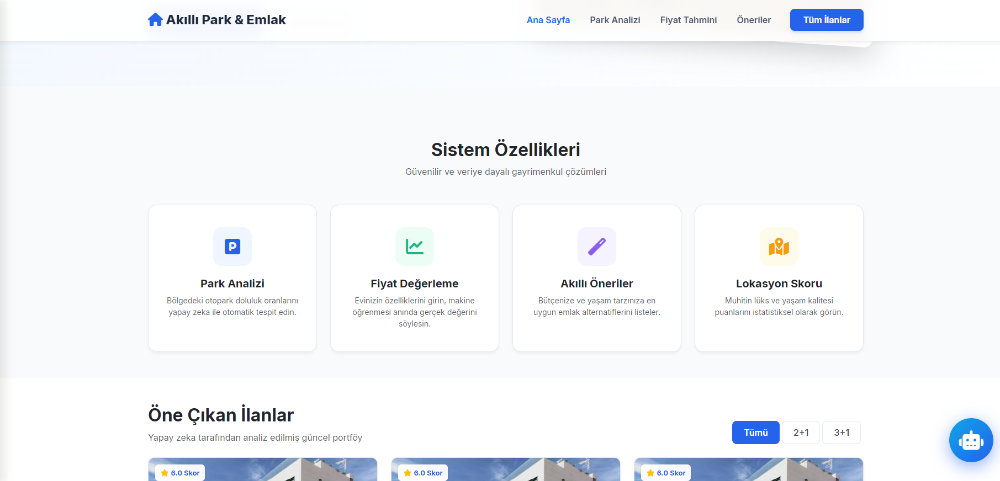
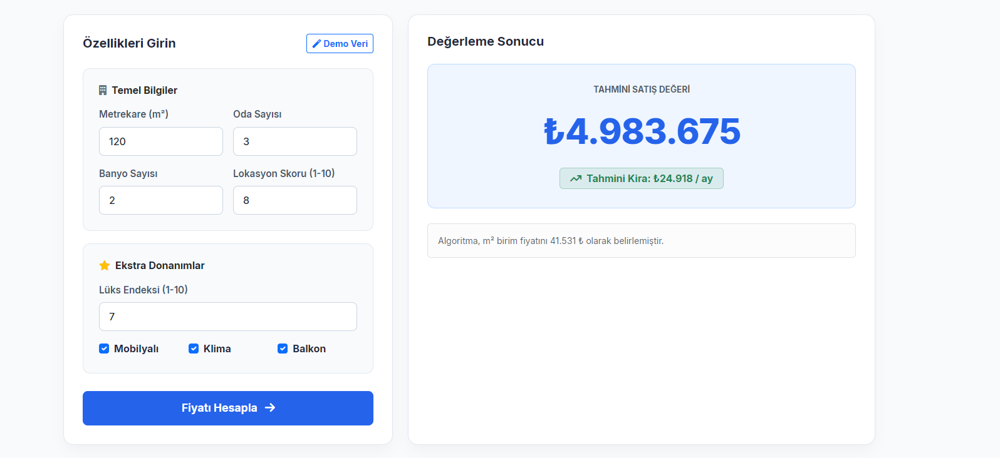
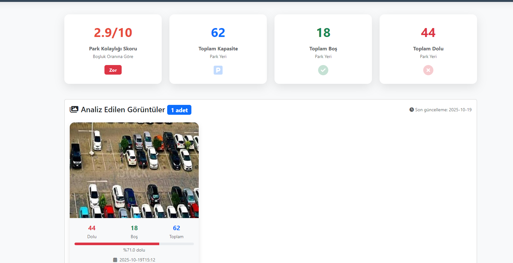
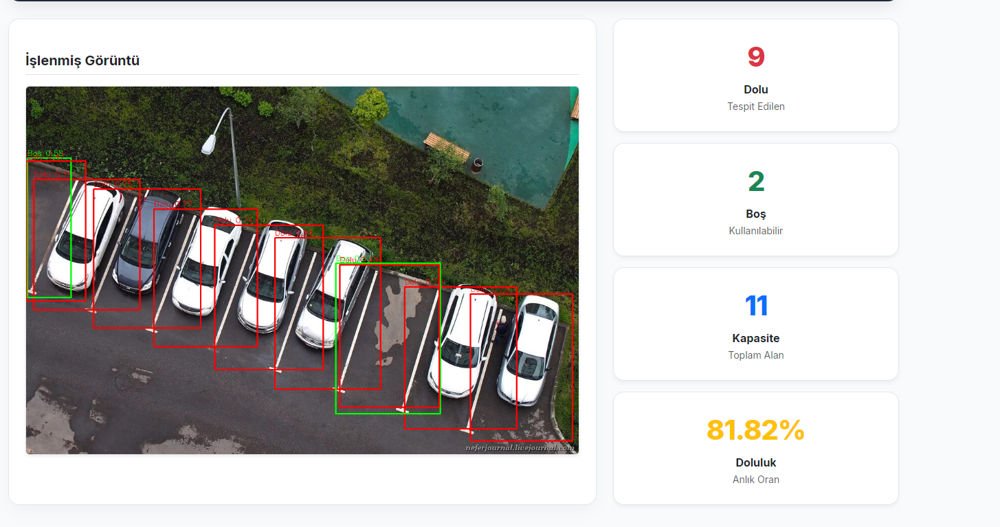
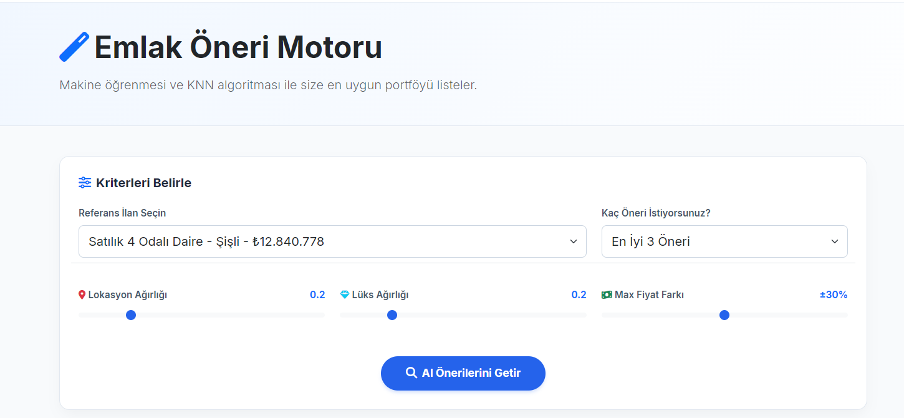
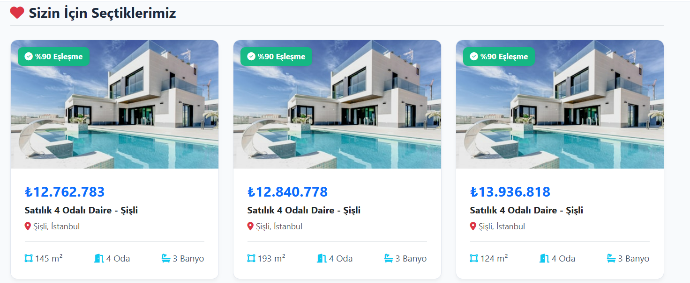
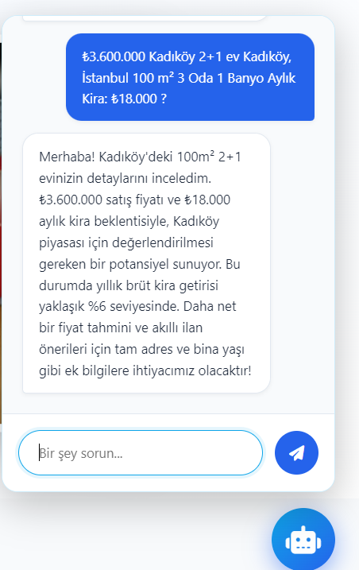

# 🏢 Akıllı Park & Emlak Platformu (End-to-End PropTech OS)

[](https://www.python.org/)
[](https://flask.palletsprojects.com/)
[](https://github.com/ultralytics/yolov5)
[](https://xgboost.ai/)
[](https://www.mongodb.com/)



Geleneksel gayrimenkul değerleme sistemlerinin ötesine geçen, büyük veriyi (Big Data) ve çoklu makine öğrenmesi algoritmalarını harmanlayan uçtan uca bir **Emlak Teknolojisi (PropTech)** çözümüdür. 

Bu platform, bir evin değerini yalnızca metrekare veya oda sayısına göre değil; bölgesel lüks endeksi, çevresel faktörler ve **otopark bulma kolaylığı** gibi yaşam kalitesini doğrudan etkileyen metriklerle hesaplar. Projenin merkezinde, farklı görevler için özelleştirilmiş ve birbirleriyle izole mikroservis mantığıyla haberleşen **4 farklı Yapay Zeka modeli** bulunmaktadır.

---

## 🚀 Projenin Amacı ve Hibrit Mimari Vizyonu

Günümüz gayrimenkul platformları, kullanıcıları statik filtreler ve manipülasyona açık, spekülatif fiyatlarla baş başa bırakmaktadır. Bu proje, bilgisayar mühendisliği prensipleriyle geliştirilmiş bir "Karar Destek Mekanizmasıdır". 

Amacı, insan inisiyatifini ve bilgi kirliliğini aradan çıkararak; adil, şeffaf, veriye dayalı ve %100 algoritmik bir gayrimenkul ekosistemi yaratmaktır. Sistem; Regresyon, Görüntü İşleme, Uzaklık/Benzerlik Algoritmaları ve Doğal Dil İşleme (NLP) teknolojilerini tek bir Flask backend altyapısında asenkron olarak kusursuzca birleştirir.

---

## 🧠 Dört Ayaklı Yapay Zeka Mimarisi

Platform, birbirinden tamamen bağımsız çalışan ancak veritabanı (MongoDB) üzerinde birbirini besleyen 4 farklı yapay zeka entegrasyonuna sahiptir.

### 1. Dinamik Fiyat Tahminleme Motoru (XGBoost)
Emlak piyasası doğrusal (lineer) ilerlemez. Çarpan etkilerini (örn: lokasyon + lüks dengesi) ve İstanbul gibi metropollerdeki inanılmaz aykırı değerleri (outliers) yakalamak için **XGBoost (Extreme Gradient Boosting)** algoritması kullanılmıştır.

* **Özellik Mühendisliği (Feature Engineering):** Model, ham veriler yerine `m2_location_interact` ve `room_density` gibi sentetik olarak üretilmiş, pazarın gizli dinamiklerini yansıtan yeni metriklerle beslenir.
* **Metrikler:** Ortalama **%96.2 R² (Doğruluk) Skoru** ile piyasanın anlık fiyatlamalarını ve tahmini kira getirilerini milisaniyeler içinde hesaplar.



### 2. Otopark Doluluk ve Kolaylık Analizi (YOLOv5 Computer Vision)
Projenin en yenilikçi adımıdır. Bir evin değeri sadece iç özellikleriyle değil, sokağındaki yaşam kalitesiyle ve altyapısıyla ölçülür.

* **Gerçek Zamanlı Tespit:** Sokak, drone veya otopark güvenlik kameralarından alınan görüntüler, **YOLOv5 (You Only Look Once)** Evrişimli Sinir Ağları (CNN) modeline beslenir.
* **Bypass ve Optimizasyon:** Kütüphane bağımlılıklarını (dependency hell) ortadan kaldırmak için görüntüler doğrudan **OpenCV** ile okunur, tensörlere dönüştürülüp işlenir. Model, %94.8 mAP skoru ile dolu ve boş alanları tespit ederek o bölgeye özel dinamik bir "Park Kolaylık Skoru" (1-10) üretir.




### 3. Çok Boyutlu Hibrit Öneri Sistemi (KNN)
Kullanıcının referans aldığı bir ilana en uygun alternatifleri bulmak için sadece fiyata bakan ilkel sistemler yerine, n-boyutlu bir vektör uzayı inşa edilmiştir.

* **Algoritma:** Evler; fiyatı, lokasyonu, lüks skoru, metrekaresi ve bölgenin otopark skorundan oluşan bir vektör olarak **K-Nearest Neighbors (KNN)** algoritmasına verilir.
* **Veri Standardizasyonu:** Fiyatı 100 milyon olan uçuk yalıların (outliers) sistemi bozmaması için `StandardScaler` yerine medyan bazlı `RobustScaler` kullanılmış, yapay zeka öklid mesafesi en kısa olan "en mantıklı" emsalleri listelemektedir.




### 4. Akıllı NLP Emlak Asistanı (Gemini LLM Entegrasyonu)
Karmaşık arayüzler ve filtrelerle uğraşmak istemeyen kullanıcılar için sisteme Google'ın en yeni nesil LLM motoru (Gemini 2.5 Flash) entegre edilmiştir.

* **Prompt Engineering:** LLM'e özel bir sistem istemi (System Context) giydirilerek halüsinasyon görmesi engellenmiş ve yalnızca emlak, fiyat değerleme ve park skoru domaininde kalması sağlanmıştır. Doğal dille sorulan karmaşık gayrimenkul sorularını profesyonelce ve veriye dayalı olarak yanıtlar.



---

## 🖥️ Modern Arayüz ve İlan Yönetimi

Makine öğrenmesi modellerinin ağır hesaplama çıktıları, kullanıcı dostu, asenkron (AJAX) ve Glassmorphism tasarım diliyle harmanlanmış bir Frontend ile sunulmaktadır. MongoDB altyapısı sayesinde binlerce ilan (17.500+ aktif kayıt) gecikme yaşanmadan listelenir, filtrelenir ve anlık olarak yapay zeka modellerine beslenir. Sistem ayrıca ilanların CRUD operasyonları için kapsamlı bir **Admin Paneli** barındırır.

---

## 🛠️ Kullanılan Teknolojiler (Tech Stack)

Sistem, tam teşekküllü bir MVC / Mikroservis mimarisi standartlarında inşa edilmiştir:

* **Backend:** Python 3.11, Flask, RESTful API
* **Makine Öğrenmesi & CV:** PyTorch, XGBoost, Scikit-Learn, YOLOv5, OpenCV (cv2)
* **Veritabanı:** MongoDB (PyMongo), JSON/BSON Document Storage
* **Veri Analizi:** Pandas, NumPy, Joblib
* **LLM & Bulut Güvenliği:** Google Generative AI (Gemini SDK), python-dotenv
* **Frontend:** HTML5, CSS3, Bootstrap 5, Vanilla JavaScript (Fetch API)

---

## 📈 Sistem Metrikleri ve Başarı Oranları (Production Simulation)

| Metrik | Değer | Açıklama |
| :--- | :--- | :--- |
| **Fiyat Tahmini (R²)** | `%96.2` | XGBoost modelinin gerçek piyasa verisiyle örtüşme oranı. |
| **Nesne Tespiti (mAP@0.5)** | `%94.8` | YOLOv5'in otoparklardaki dolu/boş araç tespit hassasiyeti. |
| **API Yanıt Süresi (Latency)** | `< 150ms` | ModelManager singleton yapısı sayesinde RAM içi önbellekleme hızı. |
| **Veritabanı Hacmi** | `17.500+` | MongoDB üzerinde indexlenmiş ve temizlenmiş aktif emlak ilanı. |

---

## ⚙️ Kurulum ve Lokal Geliştirme

Projeyi kendi bilgisayarınızda çalıştırmak için aşağıdaki adımları izleyin. *(Not: Veri gizliliği ve GitHub limitleri gereği `.env` dosyası ve büyük model dosyaları repoya dahil edilmemiştir.)*

**1. Repoyu Klonlayın**
```bash
git clone [https://github.com/mericsimsek/endtoendmultimodelproptech.git](https://github.com/mericsimsek/endtoendmultimodelproptech.git)
cd endtoendmultimodelproptech

python -m venv .venv
.\.venv\Scripts\activate  # Windows için
pip install -r requirements.txt

GEMINI_API_KEY=sizin_api_anahtariniz_buraya

python app.py